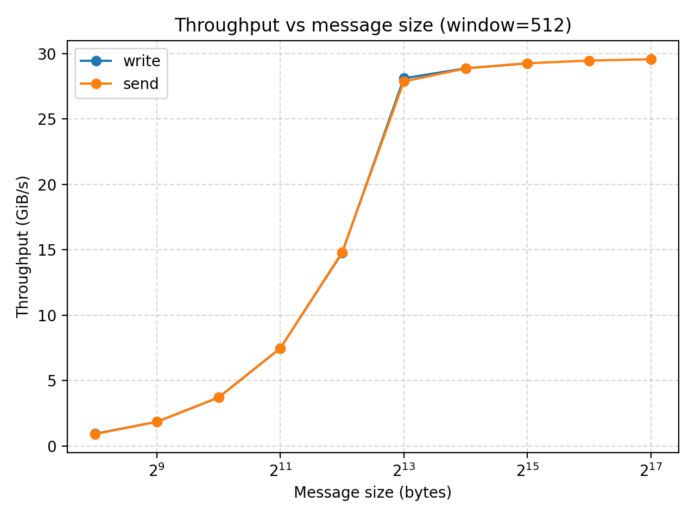
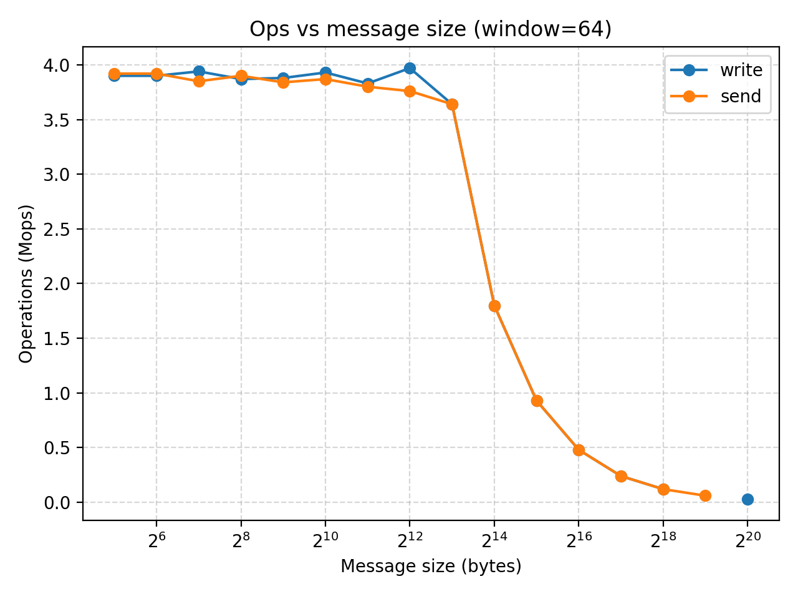
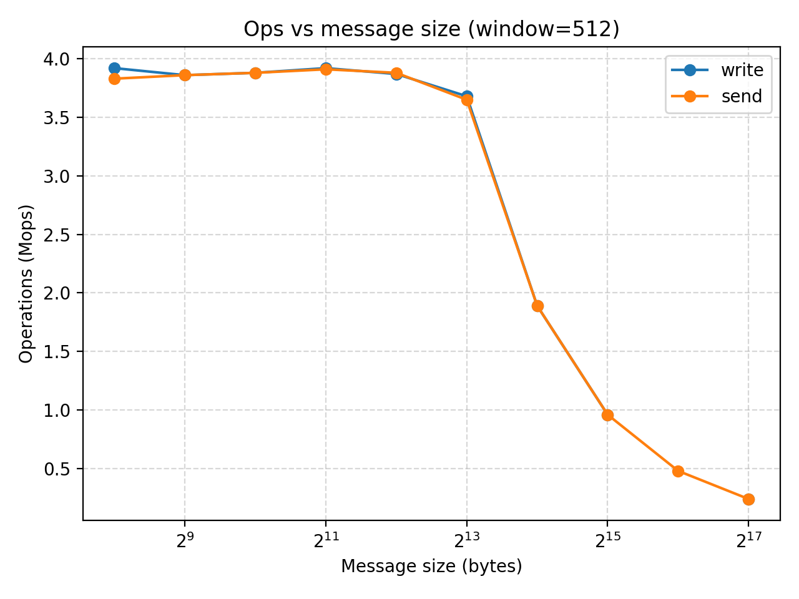
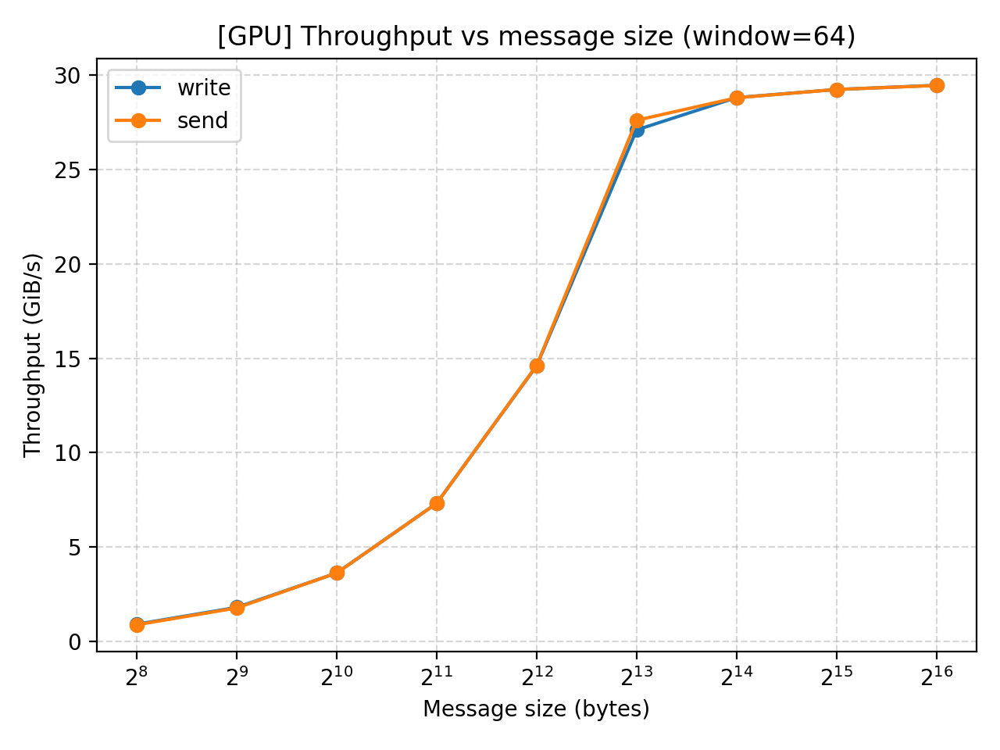
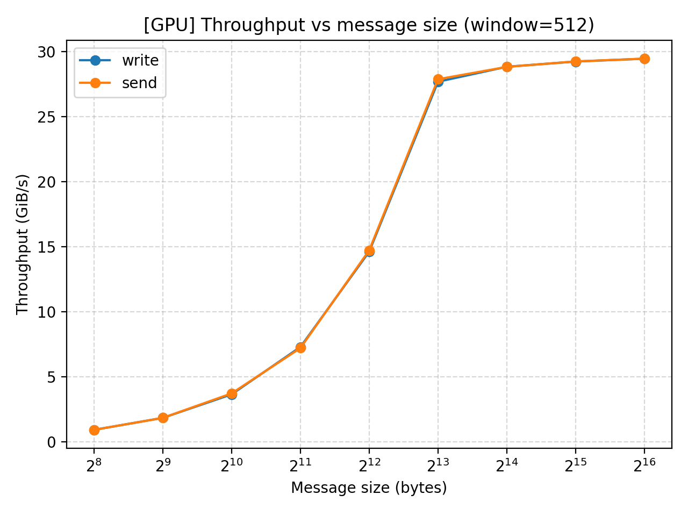
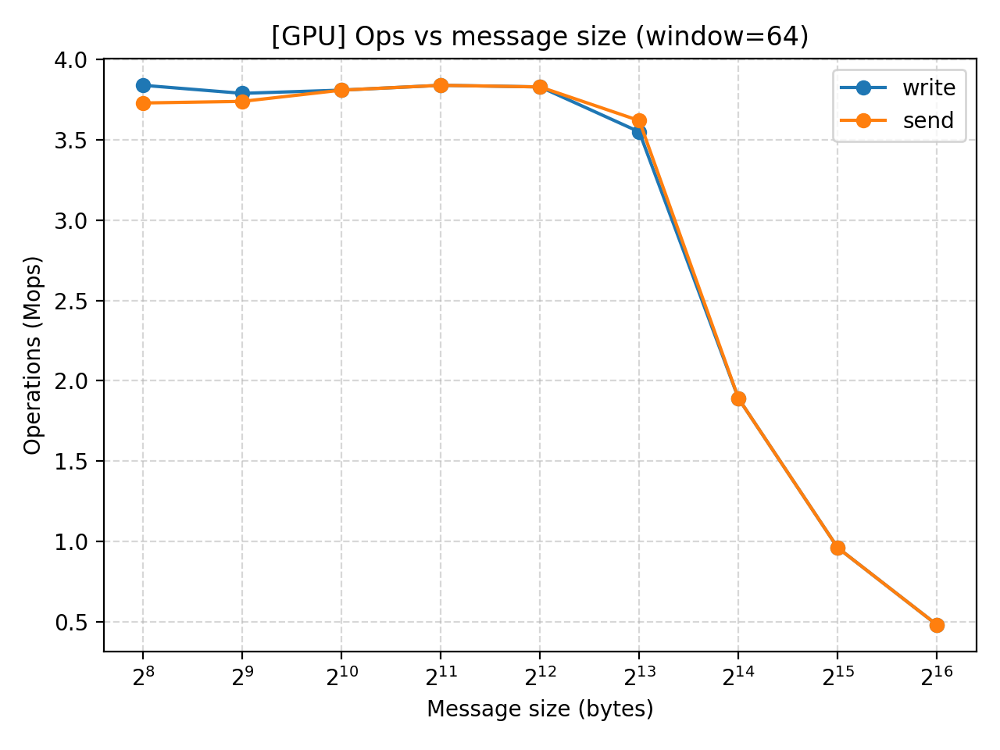
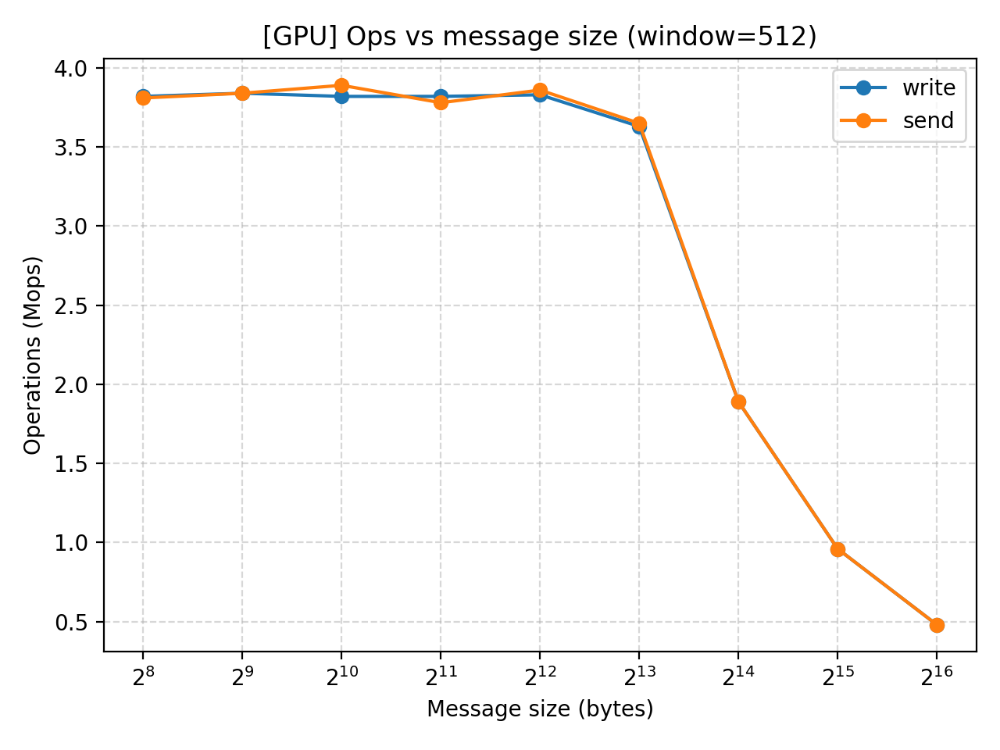

## One-sided vs Two-sided RDMA: Implementation & Benchmark API

We implement a benchmark set that allows us to measure throughput (Mops) and bandwidth (GiB/s) for:
- One-sided `RDMA READ`
- One-sided `RDMA WRITE`
- Two-sided `SEND/RECV`

The framework can tune message size, iteration count, and in-flight window/recv depth to see how performance scales. 

### Build
```bash
$ cd docs/code_examples/code/one_side_vs_two_side
$ gcc bench_server_broadcom.c -o bench_server_bench_server_broadcom -lrdmacm -libverbs
$ gcc bench_client_broadcom.c -o bench_client_broadcom -lrdmacm -libverbs
```

### Server API
```
./bench_server <port> [--mode read|write|send] [--msg N] [--iters N] [--recv-depth N]
```
- `--mode`: `read` exposes a buffer for client RDMA READ; `write` exposes a buffer for client RDMA WRITE; `send` preposts receives to accept SENDs.
- `--msg`: message size (bytes).
- `--iters`: total operations to expect.
- `--recv-depth`: number of receives preposted in SEND mode (must cover client window).

### Client API
```
./bench_client <server_ip> <port> [--mode read|write|send] [--msg N] [--iters N] [--window N]
```
- `--mode`: `read` issues one-sided RDMA READs; `write` issues one-sided RDMA WRITEs; `send` does two-sided SENDs.
- `--msg`: message size (bytes); must not exceed server-advertised buffer.
- `--iters`: total operations to issue.
- `--window`: outstanding WRs allowed in flight (match server `recv-depth` in SEND mode).

### Test results (CPU RAM)

We would like to explore the impact of message size on MOPS and bandwidth for one-side and two-side RDMA. 

We test the difference between `write` and `send` with two machines connected with CoRE.

We iterate on the message size from 32 to 8192 bytes. 

Also it is important to note that the queue depth (window) has a great impact on the results as they allow the number of operations in flight. We test both `window=64` and `window=512` to understand how the system would perform in a shallow or deep queue.

Here's our results:

|experiment|mode |msg    |window|iters |mops|gib  |
|----------|-----|-------|------|------|----|-----|
|msg_sweep |write|32     |64    |200000|3.9 |0.12 |
|msg_sweep |send |32     |64    |200000|3.92|0.12 |
|msg_sweep |write|64     |64    |200000|3.9 |0.23 |
|msg_sweep |send |64     |64    |200000|3.92|0.23 |
|msg_sweep |write|128    |64    |200000|3.94|0.47 |
|msg_sweep |send |128    |64    |200000|3.85|0.46 |
|msg_sweep |write|256    |64    |200000|3.87|0.92 |
|msg_sweep |send |256    |64    |200000|3.9 |0.93 |
|msg_sweep |write|512    |64    |200000|3.88|1.85 |
|msg_sweep |send |512    |64    |200000|3.84|1.83 |
|msg_sweep |write|1024   |64    |200000|3.93|3.75 |
|msg_sweep |send |1024   |64    |200000|3.87|3.69 |
|msg_sweep |write|2048   |64    |200000|3.83|7.31 |
|msg_sweep |send |2048   |64    |200000|3.8 |7.25 |
|msg_sweep |write|4096   |64    |200000|3.97|15.16|
|msg_sweep |send |4096   |64    |200000|3.76|14.36|
|msg_sweep |write|8192   |64    |200000|3.64|27.77|
|msg_sweep |send |8192   |64    |200000|3.64|27.76|
|msg_sweep |write|16384  |64    |200000|1.8 |27.54|
|msg_sweep |send |16384  |64    |200000|1.8 |27.41|
|msg_sweep |write|32768  |64    |200000|0.93|28.53|
|msg_sweep |send |32768  |64    |200000|0.93|28.52|
|msg_sweep |write|65536  |64    |200000|0.48|29.11|
|msg_sweep |send |65536  |64    |200000|0.48|29.1 |
|msg_sweep |write|131072 |64    |200000|0.24|29.39|
|msg_sweep |send |131072 |64    |200000|0.24|29.39|
|msg_sweep |write|262144 |64    |200000|0.12|29.52|
|msg_sweep |send |262144 |64    |200000|0.12|29.48|
|msg_sweep |write|524288 |64    |200000|nan |nan  |
|msg_sweep |send |524288 |64    |200000|0.06|29.64|
|msg_sweep |write|1048576|64    |200000|0.03|29.65|
|msg_sweep |send |1048576|64    |200000|nan |nan  |
|msg_sweep |write|256    |512   |200000|3.92|0.93 |
|msg_sweep |send |256    |512   |200000|3.83|0.91 |
|msg_sweep |write|512    |512   |200000|3.86|1.84 |
|msg_sweep |send |512    |512   |200000|3.86|1.84 |
|msg_sweep |write|1024   |512   |200000|3.88|3.7  |
|msg_sweep |send |1024   |512   |200000|3.88|3.7  |
|msg_sweep |write|2048   |512   |200000|3.92|7.47 |
|msg_sweep |send |2048   |512   |200000|3.91|7.46 |
|msg_sweep |write|4096   |512   |200000|3.87|14.75|
|msg_sweep |send |4096   |512   |200000|3.88|14.8 |
|msg_sweep |write|8192   |512   |200000|3.68|28.1 |
|msg_sweep |send |8192   |512   |200000|3.65|27.86|
|msg_sweep |write|16384  |512   |200000|1.89|28.87|
|msg_sweep |send |16384  |512   |200000|1.89|28.86|
|msg_sweep |write|32768  |512   |200000|0.96|29.25|
|msg_sweep |send |32768  |512   |200000|0.96|29.25|
|msg_sweep |write|65536  |512   |200000|nan |nan  |
|msg_sweep |send |65536  |512   |200000|0.48|29.46|
|msg_sweep |write|131072 |512   |200000|0.24|29.56|
|msg_sweep |send |131072 |512   |200000|0.24|29.56|








### Result analysis (CPU)

Regardless of window size, both settings show that when you initially increase the message size, it has not much impact of MOPS while increasing the throughput. However, once we reach a message size of relatively $2^13$ bytes (8KB), any further increase of message size would not increase the throughput while significantly decreases MOPS.

The experiment also shows that while window size could be a limitation when its very small, it is large enough, further increasing it would not affect the performance.

### Test results (GPU RAM)
This tutorial is mainly for GPU RDMA, so we also test the performance when using GPU memory.

|experiment   |mode |msg  |window|iters |mops|gib  |
|-------------|-----|-----|------|------|----|-----|
|msg_sweep_gpu|write|256  |64    |200000|3.84|0.92 |
|msg_sweep_gpu|send |256  |64    |200000|3.73|0.89 |
|msg_sweep_gpu|write|512  |64    |200000|3.79|1.81 |
|msg_sweep_gpu|send |512  |64    |200000|3.74|1.78 |
|msg_sweep_gpu|write|1024 |64    |200000|3.81|3.63 |
|msg_sweep_gpu|send |1024 |64    |200000|3.81|3.63 |
|msg_sweep_gpu|write|2048 |64    |200000|3.84|7.32 |
|msg_sweep_gpu|send |2048 |64    |200000|3.84|7.32 |
|msg_sweep_gpu|write|4096 |64    |200000|3.83|14.6 |
|msg_sweep_gpu|send |4096 |64    |200000|3.83|14.62|
|msg_sweep_gpu|write|8192 |64    |200000|3.55|27.09|
|msg_sweep_gpu|send |8192 |64    |200000|3.62|27.6 |
|msg_sweep_gpu|write|16384|64    |200000|1.89|28.8 |
|msg_sweep_gpu|send |16384|64    |200000|1.89|28.79|
|msg_sweep_gpu|write|32768|64    |200000|0.96|29.23|
|msg_sweep_gpu|send |32768|64    |200000|0.96|29.23|
|msg_sweep_gpu|write|65536|64    |200000|0.48|29.45|
|msg_sweep_gpu|send |65536|64    |200000|0.48|29.44|
|msg_sweep_gpu|write|256  |512   |200000|3.82|0.91 |
|msg_sweep_gpu|send |256  |512   |200000|3.81|0.91 |
|msg_sweep_gpu|write|512  |512   |200000|3.84|1.83 |
|msg_sweep_gpu|send |512  |512   |200000|3.84|1.83 |
|msg_sweep_gpu|write|1024 |512   |200000|3.82|3.64 |
|msg_sweep_gpu|send |1024 |512   |200000|3.89|3.71 |
|msg_sweep_gpu|write|2048 |512   |200000|3.82|7.28 |
|msg_sweep_gpu|send |2048 |512   |200000|3.78|7.2  |
|msg_sweep_gpu|write|4096 |512   |200000|3.83|14.61|
|msg_sweep_gpu|send |4096 |512   |200000|3.86|14.71|
|msg_sweep_gpu|write|8192 |512   |200000|3.63|27.67|
|msg_sweep_gpu|send |8192 |512   |200000|3.65|27.86|
|msg_sweep_gpu|write|16384|512   |200000|1.89|28.82|
|msg_sweep_gpu|send |16384|512   |200000|1.89|28.81|
|msg_sweep_gpu|write|32768|512   |200000|0.96|29.22|
|msg_sweep_gpu|send |32768|512   |200000|0.96|29.23|
|msg_sweep_gpu|write|65536|512   |200000|0.48|29.44|
|msg_sweep_gpu|send |65536|512   |200000|0.48|29.44|









### Result analysis (GPU)
Similar performances exhibit in our GPU test. The throughput increase with message size but the effect eventually converges at $2^13$. MOPS does not change until that point when it starts to drop as we increase message size even further.

### Conclusion 

“Our experiments reveal an interesting finding: with a window size of 64 or 256, the `send` and `write` operations show no statistically significant performance difference when using Our Broadcom RoCE NIC that runs at 400 Gb/s (theoretical peak ≈ 46.6 GiB/s). Our best GPU-direct RDMA benchmark reaches about 30 GiB/s, i.e., ~64% of the line rate. To further increase the performance, we need to optimized the QPs and polling.

Thus, we arrive at a somewhat counterintuitive conclusion that, under our experimental setup, one-sided and two-sided operations exhibit no observable performance difference.