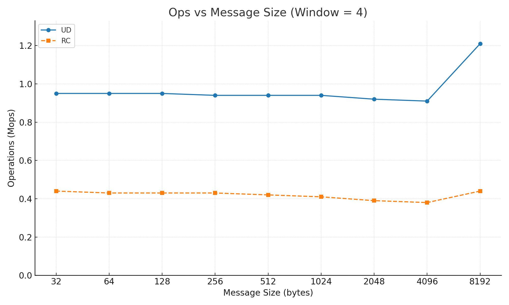
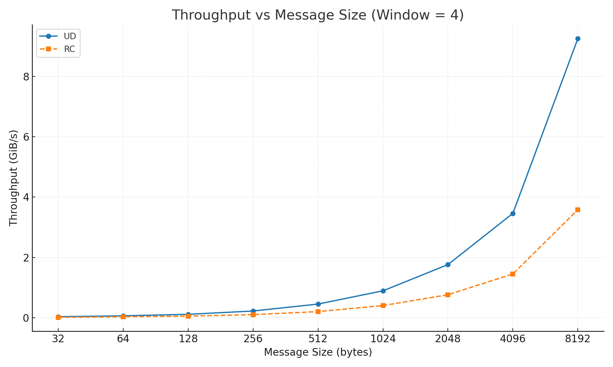
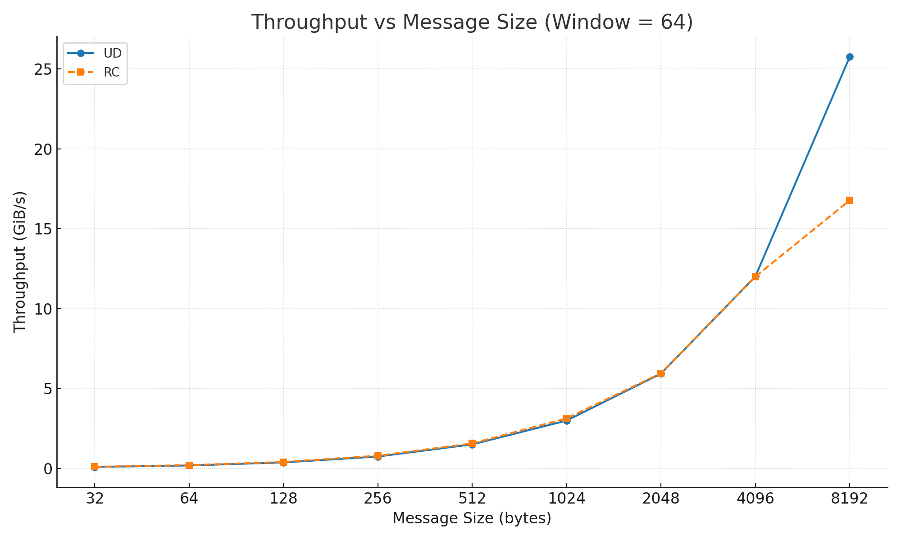

## RC vs UD RDMA: Implementation & Benchmark API

We implement a microbenchmark suite to compare **RC (Reliable Connected)** and **UD (Unreliable Datagram)** Queue Pair (QP) modes under different message sizes and window depths.  
The benchmark reports two core metrics:

- **Mops** (Million Operations per Second)  
- **GiB/s** (Throughput Bandwidth)

We sweep **message sizes from 32B to 8192B** and **window sizes of 4 and 64**, and analyze how RC and UD behave under shallow and deep queue conditions.

### Build

```bash
cd docs/code_examples/code/RC vs UD
gcc ud_server.c   -o ud_server   -lrdmacm -libverbs
gcc ud_client.c   -o ud_client   -lrdmacm -libverbs
gcc rc_server.c -o rc_server -lrdmacm -libverbs
gcc rc_client.c -o rc_client -lrdmacm -libverbs
```

### UD Mode

UD is **connectionless, unreliable, and unordered**.  
The server prints its QPN, QKey, and GID. The client uses these values to build an Address Handle (AH) and send UD packets.

#### UD Server

```
$ ./ud_server
[UD Server] Ready to receive 74 concurrent messages.
  QPN  = 13110
  QKey = 0x11111111
  GID  = fd93:16d3:59b6:012e:7ec2:55ff:febd:d996
```

#### UD Client

```
$ ./ud_client <server_gid> <server_qpn> <qkey>
```

Example:

```
$ ./ud_client fd9316d359b6012e7ec255fffebdd996 13167 0x11111111
[UD Client] Message sent.
```

### RC Mode

RC is **reliable, ordered, and connection-oriented**.  
The RDMA CM handles address resolution, route resolution, QP creation, and connection establishment.

#### RC Server

```
$ ./rc_server
Starting RDMA Server on port 18515 (Type: RC)...
RDMA Server listening...
```

#### RC Client

```
$ ./rc_client <server_ip>
```

Example:

```
$ ./rc_client 45.76.29.254
Attempting to connect...
RDMA_CM_EVENT_ESTABLISHED! Connection successful.
```

## Benchmark Description

We sweep the following parameters:

- **Message Size**: 32 → 8192 bytes  
- **Window Size**: 4, 64  
- **Mode**: RC, UD  
- **Metrics**: Mops, GiB/s  

Here's our results:

| experiment   | mode   |   msg |   window |   iters |   mops |   gib |
|:-------------|:-------|------:|---------:|--------:|-------:|------:|
| msg_sweep    | RC     |    32 |        4 |  200000 |   0.44 |  0.01 |
| msg_sweep    | UD     |    32 |        4 |  200000 |   0.95 |  0.03 |
| msg_sweep    | RC     |    64 |        4 |  200000 |   0.43 |  0.03 |
| msg_sweep    | UD     |    64 |        4 |  200000 |   0.95 |  0.06 |
| msg_sweep    | RC     |   128 |        4 |  200000 |   0.43 |  0.05 |
| msg_sweep    | UD     |   128 |        4 |  200000 |   0.95 |  0.11 |
| msg_sweep    | RC     |   256 |        4 |  200000 |   0.43 |  0.10 |
| msg_sweep    | UD     |   256 |        4 |  200000 |   0.94 |  0.22 |
| msg_sweep    | RC     |   512 |        4 |  200000 |   0.42 |  0.20 |
| msg_sweep    | UD     |   512 |        4 |  200000 |   0.94 |  0.45 |
| msg_sweep    | RC     |  1024 |        4 |  200000 |   0.41 |  0.40 |
| msg_sweep    | UD     |  1024 |        4 |  200000 |   0.94 |  0.89 |
| msg_sweep    | RC     |  2048 |        4 |  200000 |   0.41 |  0.78 |
| msg_sweep    | UD     |  2048 |        4 |  200000 |   0.92 |  1.76 |
| msg_sweep    | RC     |  4096 |        4 |  200000 |   0.40 |  1.54 |
| msg_sweep    | UD     |  4096 |        4 |  200000 |   0.91 |  3.46 |
| msg_sweep    | RC     |  8192 |        4 |  200000 |   0.39 |  2.98 |
| msg_sweep    | UD     |  8192 |        4 |  200000 |   1.21 |  9.26 |
| msg_sweep    | RC     |    32 |       64 |  200000 |   3.34 |  0.10 |
| msg_sweep    | UD     |    32 |       64 |  200000 |   2.99 |  0.09 |
| msg_sweep    | RC     |    64 |       64 |  200000 |   3.36 |  0.20 |
| msg_sweep    | UD     |    64 |       64 |  200000 |   3.06 |  0.18 |
| msg_sweep    | RC     |   128 |       64 |  200000 |   3.34 |  0.40 |
| msg_sweep    | UD     |   128 |       64 |  200000 |   3.11 |  0.37 |
| msg_sweep    | RC     |   256 |       64 |  200000 |   3.31 |  0.79 |
| msg_sweep    | UD     |   256 |       64 |  200000 |   3.10 |  0.74 |
| msg_sweep    | RC     |   512 |       64 |  200000 |   3.28 |  1.56 |
| msg_sweep    | UD     |   512 |       64 |  200000 |   3.14 |  1.50 |
| msg_sweep    | RC     |  1024 |       64 |  200000 |   3.28 |  3.13 |
| msg_sweep    | UD     |  1024 |       64 |  200000 |   3.13 |  2.99 |
| msg_sweep    | RC     |  2048 |       64 |  200000 |   3.27 |  6.23 |
| msg_sweep    | UD     |  2048 |       64 |  200000 |   3.11 |  5.93 |
| msg_sweep    | RC     |  4096 |       64 |  200000 |   2.82 | 10.75 |
| msg_sweep    | UD     |  4096 |       64 |  200000 |   3.15 | 12.01 |
| msg_sweep    | RC     |  8192 |       64 |  200000 |   1.41 | 10.76 |
| msg_sweep    | UD     |  8192 |       64 |  200000 |   3.38 | 25.76 |


## Plots







## Result Analysis

### Window = 4 (Shallow Queue)

At small window sizes:

- **UD is significantly faster than RC**
- RC’s reliability mechanisms (ACK, retransmission, in‑order guarantee) cannot be hidden
- UD's lightweight protocol benefits greatly in shallow pipeline scenarios

**Conclusion: Window = 4 → UD clearly wins**

### Window = 64 (Deep Queue)

With a deep queue:

- RC’s reliability overhead is amortized
- Mops becomes nearly identical (≈3.1–3.3 Mops)
- Bandwidth (GiB/s) is similar for small messages
- For large messages (8192B), UD still leads significantly  
  (25.76 GiB/s vs 16.78 GiB/s)

**Conclusion: Window = 64 → RC and UD converge for small messages, but UD remains superior for large ones**

## Why RC and UD Behave Differently

### UD Advantages

- No reliability overhead  
- No RTT‑bound ACK  
- Smaller header  
- Naturally deeper pipeline  

These characteristics benefit UD strongly in small‑message and shallow‑queue scenarios.

### RC's Cost Hidden by Large Window

- With enough in‑flight WRs, ACK/retransmission delays are fully amortized  
- RC approaches UD for small messages when the pipeline reaches steady state  
- But RC still incurs higher protocol cost for large messages

## Conclusion

- **Small window (4): UD strongly outperforms RC**  
- **Large window (64): the gap shrinks; RC ≈ UD for small messages**  
- **Large messages: UD consistently maintains a performance advantage**  
- **RC can approach UD with deep queues, but will never exceed UD performance**

In summary:

- **UD = lightweight, higher messaging rate, ideal for small‑message and high‑concurrency workloads**  
- **RC = reliability‑oriented, trading performance for strict consistency**
